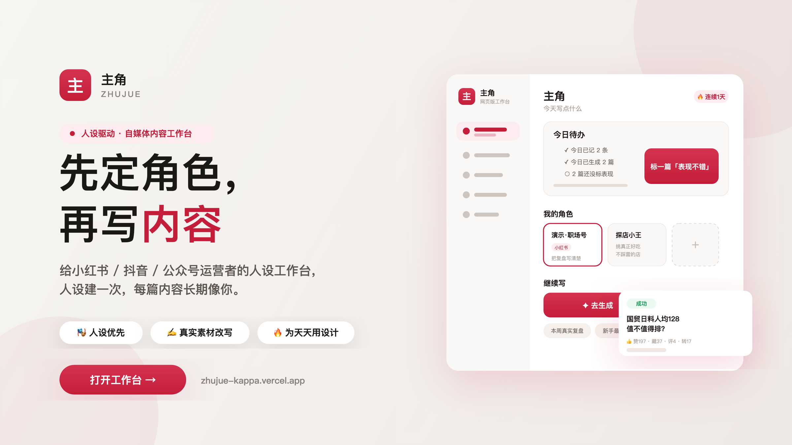

  

<h1 align="center">主角 · Zhujue</h1>

  <b>先定角色，再写内容</b> 
  给小红书 / 抖音 / 公众号运营者的 <b>人设驱动内容工作台</b>

  
  &nbsp;
  

  
  
  
  

---

## 一句话

> 把「每次重写提示词」变成「固定角色资产」——人设建一次，内容长期像你。

|  | 一般 AI 写作 | **主角** |
|---|---|---|
| 起点 | 空白聊天框碰运气 | **先建人设**，每次自动注入 |
| 事实 | 假大空、容易编 | **真实日记 / 素材** 再改写 |
| 平台 | 一份文案到处发 | **分平台成文**：小红书 / 抖音 / 公众号各按规矩写 |
| 复用 | 用完即走 | **今日待办 · 连续记录 · 数据回流** 闭环 |

---

## 核心能力

### 🎭 角色是系统中枢，不是一句提示词

  

一个角色沉淀这些字段，之后每次生成自动带上：

- **定位**：主平台、一句话定位、目标用户、账号目标（涨粉 / 私域 / 种草带货 / 品牌心智 / 强化人设）
- **表达风格**：从 亲切 / 专业 / 干货 / 幽默 / 犀利 / 温柔 / 理性 / 真诚 里选**最多 4 个**语气，加关键词与口头禅
- **红线避雷**：写明「绝不出现」的话术（如医疗功效承诺、贩卖焦虑），生成时主动规避

> 不想从零填？内置 **成分党美妆博主 / 职场成长博主 / 知识科普号** 等模板，一键套用再改。

### ✍️ 分平台生成，各按各的规矩

同一个想法，选不同平台会写成**完全不同的形态**——因为每个平台内置了独立的成文规则：

| 平台 | 篇幅 | 风格要点 |
|---|---|---|
| **小红书** | 300–800 字 | 第一人称口语、痛点/场景开场、正文 3–6 个 emoji、3 个标题拉开角度 |
| **抖音** | 220–400 字（45–60 秒口播） | 逐字稿一句一行、钩子→铺垫→3 要点→升华→互动五层、标题 8–18 字 |
| **公众号** | 900–1800 字 | 第二人称深度成文、中文序号分层、`【图n｜说明】` 图文穿插 |

支持 **主题生成**（给方向自动出稿）和 **素材改写**（忠实原意 / 强化人设两档）。

### 📔 日记 · 把碎片灵感变成选题

  

随手记一句或粘贴截图 → 自动挂到最近角色 → 生成**整理摘要**与**推荐选题**，写的时候不再对着空白发呆。

### 🖼️ 素材库 · 图片 / 视频 / 笔记，理解后复用

  

上传图片、短视频关键帧或笔记，AI 生成**理解摘要**沉淀下来；改写时一键复用，不用每次重新上传。**事实来自素材，口吻来自人设。**

### 📈 历史成稿 · 拿到手就是能发的稿

  

每篇都含标题、正文、封面文案与匹配说明，可复制、再生成、标「表现不错」。真实产出示例：

- **《国贸日料人均128值不值得排：刺身新鲜、等位40分钟、适合请客不适合独食》** · 探店号 · 小红书
- 一键导出 **`.md` 草稿** 或 **`.json` 发布包**（含分平台粘贴包与发布检查清单，可对接 social-auto-upload、公众号草稿箱）

### 🔁 数据回流 · 让效果反哺人设

打通 **小红书 MCP**，把已发布笔记的**赞 / 藏 / 评 / 转**同步回来，沉淀成每个角色的表现数据。

- **不存小红书账号密码**，通过本地 MCP 授权，支持定时同步
- 没接 MCP 也能用「一键载入演示」体验完整闭环
- 结合**角色进化**：把跑得好的关键词 / 必强调 / 避雷点，经你确认后写回角色，越用越准

### 🔥 为「天天用」设计

  

打开工作台就知道下一步做什么：今日待办、连续创作记录、近半年**创作热力图**、发展时间线与创作数据面板，把「偶尔写一篇」变成可持续的内容节奏。

---

## 3 分钟上手

1. 打开 **[网页版工作台](https://zhujue-kappa.vercel.app)**（手机用 [手机版](https://zhujue-kappa.vercel.app/app)），邮箱 + 密码注册即用
2. **新建角色**（或套用内置模板）
3. 记一条日记 / 传一张素材 → **去生成** → 选平台 → 复制或导出发布
4. 发布后可选接入小红书 MCP，让赞藏评数据回流

> 每天有免费额度；在「设置」里填入**自备模型 API Key**可获得更稳定、额度自主的生成体验。

---

## 常见问题

<b>要花钱 / 要自己的模型 Key 吗？</b>
 

每天有免费额度可直接用。想要更快更稳、额度自主，可在「设置」里填入自备模型 API Key。

<b>接入小红书会泄露账号吗？</b>
 

不会。数据回流通过本地 <b>小红书 MCP</b> 授权完成，<b>不存储你的账号密码</b>，只把已发布内容的赞藏评等公开互动数据同步回来。也可以用「一键载入演示」先体验。

<b>一份文案能同时发三个平台吗？</b>
 

主角是<b>分平台成文</b>：小红书、抖音、公众号各有独立的篇幅、结构与风格规则，同一想法会写成三种不同形态，而不是一稿到处贴。

<b>要下载 App 吗？</b>
 

不用。网页版打开即用，手机访问 <a href="https://zhujue-kappa.vercel.app/app">手机版</a> 已做移动端适配。

---

  

<b>一句话转发文案</b>

> 主角：先定角色，再写内容。小红书 / 抖音 / 公众号分平台成文，还能把赞藏评数据回流反哺人设。 
> https://zhujue-kappa.vercel.app

---

关于本仓库
 

这是「主角 · Zhujue」的产品介绍页，仅包含展示用文案与截图，<b>非业务源码</b>。 
使用问题、体验反馈或功能建议，欢迎提 <a href="https://github.com/Zita-Go/zhujue-home/issues">Issues</a>。

