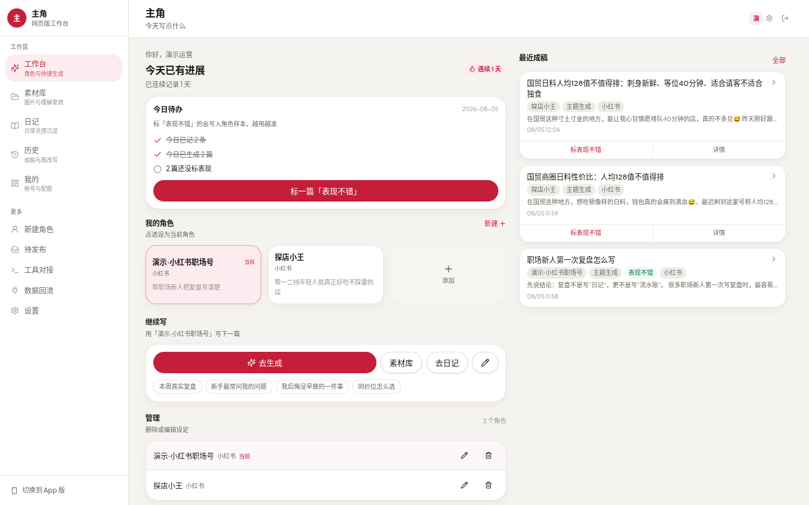
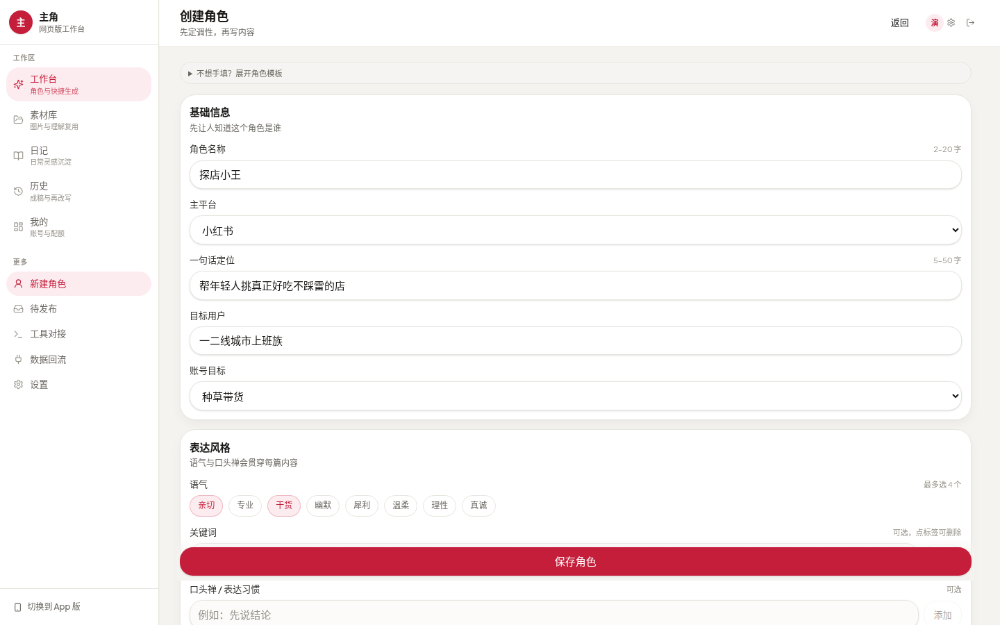
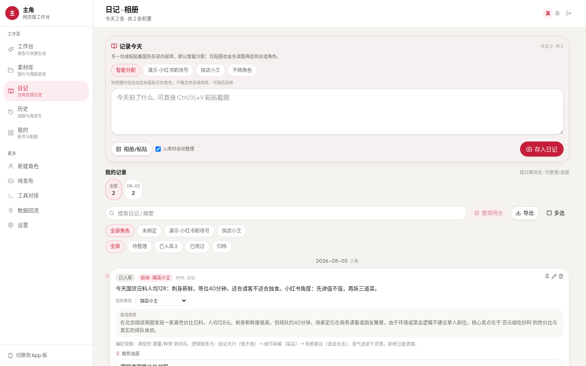
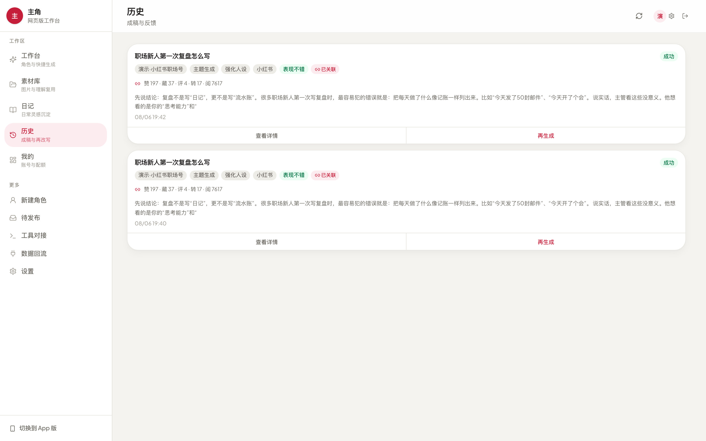
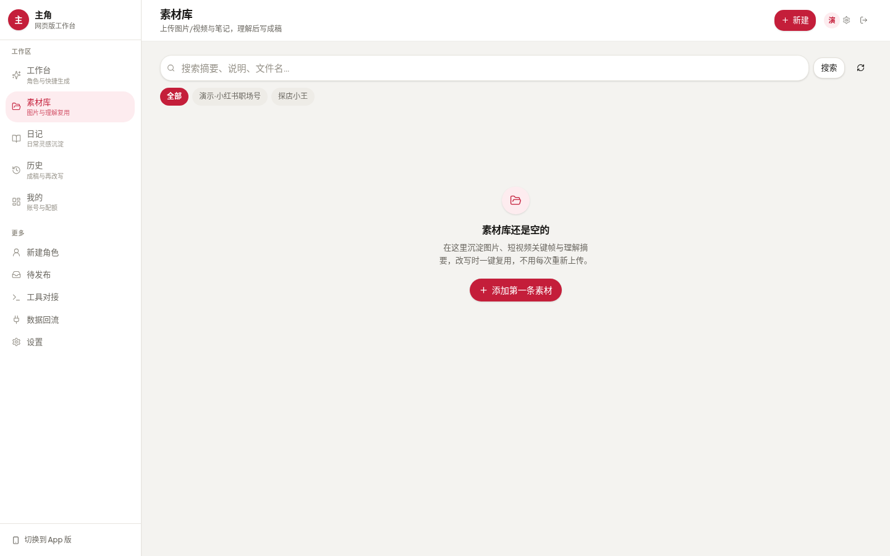

  

<h1 align="center">主角 · Zhujue</h1>

  <b>先定角色，再写内容</b> 
  给小红书 / 抖音 / 公众号运营者的 <b>人设驱动内容工作台</b>

  
  &nbsp;
  

  
  
  

---

## 一句话

> 把「每次重写提示词」变成「固定角色资产」——人设建一次，内容长期像你。

|  | 一般 AI 写作 | **主角** |
|---|---|---|
| 起点 | 空白聊天框碰运气 | **先建人设**，每次自动注入 |
| 事实 | 假大空、容易编 | **真实素材 / 日记** 再改写 |
| 复用 | 用完即走 | **今日待办 · 连续记录 · 反馈** 闭环 |

---

## 产品长什么样（真实界面 · 有内容）

### 1. 工作台 · 今天该做什么一目了然

  

当前角色、今日待办、连续记录、一键去生成——打开就知道下一步做什么。

### 2. 创建角色 · 人设是系统中枢

  

定位、主平台、目标用户、语气标签、口头禅 —— **每一篇生成的底座**，矩阵不串味。

### 3. 日记 · 碎片灵感变成选题

  

随手记录或粘贴截图 → 自动挂到最近角色 → **整理摘要 + 推荐选题**。

### 4. 历史成稿 · 标题与正文已生成

  

真实产出示例（可复制 / 再生成 / 标「表现不错」）：

- **《国贸日料人均128值不值得排：刺身新鲜、等位40分钟、适合请客不适合独食》** · 探店小王 · 小红书
- **《职场新人第一次复盘怎么写》** · 演示职场号 · 含赞 197 / 藏 37 / 评 4 / 转 17 数据回流

拿到手的是能直接发的成稿，不是一张空白页。

### 5. 素材库 · 图片 / 视频 / 笔记入库再改写

  

素材理解后挂到角色，生成时勾选 —— **事实来自素材，口吻来自人设**，不用每次重新上传。

---

## 三大卖点

1. **人设优先** — 定位 / 语气 / 红线写进角色，多号矩阵各说各话不串味
2. **真实输入改写** — 日记、图片、视频、笔记 → 标题 / 正文 / 标签
3. **为天天用设计** — 今日待办、连续记录、「表现不错」反馈，形成可持续的内容节奏

---

## 3 分钟上手

1. 打开 **[网页版工作台](https://zhujue-kappa.vercel.app)**（手机扫码用 [手机版](https://zhujue-kappa.vercel.app/app)）
2. 注册：显示名 + 邮箱 + 密码
3. **新建角色** → 记一条日记或上传素材 → **去生成** → 复制发布

> 建议在「设置」里配置 **自备模型 API Key**，生成更稳、更快、额度自主。

---

## 常见问题

<b>要下载 App 吗？</b>
 

不用。网页版打开即用，手机端访问 <a href="https://zhujue-kappa.vercel.app/app">手机版</a> 即可，界面已针对手机适配。

<b>支持哪些平台的内容？</b>
 

主要面向 <b>小红书 / 抖音 / 公众号</b>。创建角色时选择主平台，生成时会套用对应平台的表达习惯。

<b>需要自己的模型 Key 吗？</b>
 

可以直接试用；如需更稳定、额度自主的生成体验，建议在「设置」中填入 <b>自备模型 API Key</b>。

<b>我的素材和数据安全吗？</b>
 

角色、日记、素材都归属你自己的账号，用于生成你自己的内容。请勿上传涉密或他人隐私素材。

---

  

<b>一句话转发文案</b>

> 主角：先定角色，再写内容。小红书 / 抖音 / 公众号人设工作台。 
> https://zhujue-kappa.vercel.app

---

关于本仓库
 

这是「主角 · Zhujue」的产品介绍页，仅包含展示用文案与截图，<b>非业务源码</b>。 
使用问题、体验反馈或功能建议，欢迎提 <a href="https://github.com/Zita-Go/zhujue-home/issues">Issues</a>。

